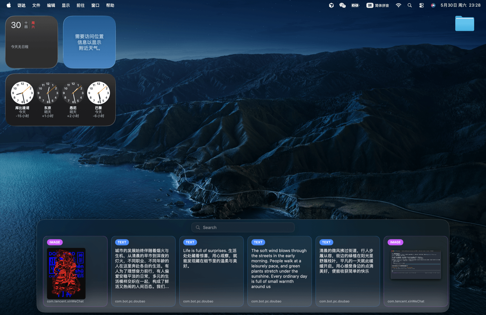

# myPaste

[](https://github.com/AtomLh/myPaste/actions/workflows/ci.yml)
[](LICENSE)
[](https://www.apple.com/macos/)

A free, open-source clipboard manager for macOS with Paste-style horizontal cards instead of the usual vertical list.



Press **⌘⇧V** to bring up a horizontal card view at the bottom of the screen. Type to search, click a card and it pastes back to whatever app you were just in. Text and images, last 200 items. Passwords copied from 1Password / Bitwarden are skipped automatically.

Built because I didn't want to keep paying Paste's subscription.

## Why this and not Maccy?

If Maccy's vertical Spotlight-style list fits your workflow, use Maccy — it's more mature and has more features. This is for people who specifically miss Paste's horizontal-card layout but don't want to pay $14.99/year for it.

## Install

### Option A — Download a release

1. Grab the latest `myPaste.app.zip` from [Releases](../../releases) and unzip into `/Applications`.
2. Because the binary isn't signed, the first launch is blocked. **Right-click → Open**, then click "Open" in the dialog. One-time only.

### Option B — Build from source

```bash
git clone https://github.com/AtomLh/myPaste.git
cd myPaste
scripts/make_app_bundle.sh
open build/myPaste.app
```

Requires Swift 6+ and macOS 14+.

## Grant Accessibility permission

Paste-back simulates ⌘V, which macOS gates behind the Accessibility permission. Add the app under:

```
System Settings → Privacy & Security → Accessibility
```

Toggle it on, then restart:

```bash
killall myPaste && open /Applications/myPaste.app
```

Without it, clicking a card only writes to the system clipboard — you'd press ⌘V manually.

## Auto-start at login

```bash
scripts/install_launchagent.sh
```

Installs a LaunchAgent so it launches at every login. Remove anytime with `scripts/uninstall_launchagent.sh`.

## Usage

| Action | Behavior |
|---|---|
| ⌘⇧V | Toggle HUD |
| Type | Filter text items live |
| Click card | Paste back to previous app |
| Click outside / Esc | Dismiss |

History and image cache live in `~/Library/Application Support/myPaste/`.

## Development

```bash
swift test                       # run unit tests (currently 44, all green)
swift build                      # build the executable
scripts/make_app_bundle.sh       # produce build/myPaste.app
scripts/make_release.sh 0.1.0    # produce build/release/myPaste-0.1.0.zip
```

The core business logic lives in `Sources/myPasteCore` behind protocols, so unit tests use in-memory fakes for everything (pasteboard, file system, keystrokes). The AppKit bridge is in the same module but behind those protocols; it's exercised through manual acceptance.

## License

MIT — see [LICENSE](LICENSE).

---

## 中文

仿 Paste 的横向卡片式 macOS 剪贴板管理器，开源免费。

按 **⌘⇧V** 从屏幕底部召出横向卡片，输入搜索，点一下就粘回原应用。文本 + 图片，保留最近 200 条。1Password / Bitwarden 之类密码管理器复制的密码会自动跳过。

不想再付 Paste 的订阅，所以做了这个。

### 为什么不用 Maccy？

喜欢 Maccy 的竖向列表就用 Maccy，更成熟、功能也多。这个项目专门给那些想要 Paste 那种横向卡片体验、但不愿意付订阅的人。

### 安装

**方式 A — 下载发布包**

1. 从 [Releases](../../releases) 下最新的 `myPaste.app.zip`，解压拖进 `/Applications`。
2. 没签名，首次打开会被 Gatekeeper 拦。**右键 → 打开**，弹框里点"打开"。只需这一次。

**方式 B — 自己编译**

```bash
git clone https://github.com/AtomLh/myPaste.git
cd myPaste
scripts/make_app_bundle.sh
open build/myPaste.app
```

需要 Swift 6+ / macOS 14+。

### 给辅助功能权限

模拟 ⌘V 必须有辅助功能权限，否则点条目只会复制到剪贴板。把 myPaste 加进：

```
系统设置 → 隐私与安全性 → 辅助功能
```

打开开关，然后重启 app：

```bash
killall myPaste && open /Applications/myPaste.app
```

### 开机自启

```bash
scripts/install_launchagent.sh
```

撤销：`scripts/uninstall_launchagent.sh`。

### 用法

| 操作 | 行为 |
|---|---|
| ⌘⇧V | 召出 / 收起 |
| 输入 | 实时过滤文本 |
| 点卡片 | 粘回原应用 |
| 点外面 / Esc | 关闭 |

数据：`~/Library/Application Support/myPaste/`

### License

MIT
